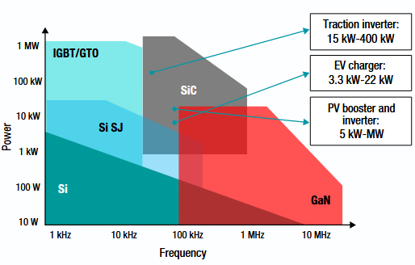

# 电力电子硬件入门指南  
本文档面向全国大学生电子设计竞赛电力电子方向,介绍硬件相关入门基础知识  
作者： 电气23.3 毛晨镔  
日期：2025/07/04  

- [电力电子硬件入门指南](#电力电子硬件入门指南)
  - [通用器件](#通用器件)
    - [电容](#电容)
      - [多层陶瓷电容(MLCC)：](#多层陶瓷电容mlcc)
      - [电解电容：](#电解电容)
      - [MKP电容](#mkp电容)
      - [瓷片电容](#瓷片电容)
      - [聚丙烯电容(CBB电容)](#聚丙烯电容cbb电容)
      - [安规电容](#安规电容)
    - [电感](#电感)
      - [直插电感](#直插电感)
      - [共模电感/差模电感](#共模电感差模电感)
      - [功率电感](#功率电感)
      - [绕线电感](#绕线电感)
    - [电阻](#电阻)
      - [采样电阻](#采样电阻)
      - [普通电阻](#普通电阻)
      - [绕线电阻](#绕线电阻)
      - [水泥电阻](#水泥电阻)
    - [连接线](#连接线)
  - [功率器件](#功率器件)
    - [栅极驱动器](#栅极驱动器)
    - [MOSFET](#mosfet)
    - [二极管](#二极管)
      - [肖特基](#肖特基)
      - [开关二极管](#开关二极管)
      - [快恢复](#快恢复)
      - [整流二极管](#整流二极管)
      - [稳压二极管](#稳压二极管)
      - [TVS/ESD二极管](#tvsesd二极管)
    - [整流桥](#整流桥)
    - [理想二极管](#理想二极管)
  - [集成器件](#集成器件)
    - [运放](#运放)
    - [比较器](#比较器)
    - [基准源芯片](#基准源芯片)
    - [PFC控制器](#pfc控制器)
    - [光耦](#光耦)

---

## 通用器件  
### 电容  
**所有电容都有耐压限制,建议降额至额定80%-90%使用**  
分类：CBB电容/贴片MLCC(直插独石电容)/电解电容/瓷片电容/MKP电容  
选型参数：用途/ESR/频率/耐压/容值  
寄生参数：ELR/ESL,低频以ESR为主,高频考虑ESL谐振  

注意事项：
 - 电容注意耐压值,建议降压为原来90%使用  
 - 电解电容ESL极大,10KHz左右即可发生谐振,高频下呈现感性。  
 - 用电解电容滤波时,必须并联MKP(功率)/MLCC(低压)  
 - **栅极自举电容绝对不可以用电解电容,必须用MLCC**  
 - 任何低压模拟信号,均推荐MLCC+贴片+C0G/NP0/X7R  

#### 多层陶瓷电容(MLCC)：  
一般贴片无极性的电容都是MLCC,直插独石电容也为MLCC  
性能好,高频特性好,但是受限于封装,容值不大(0805最大10uF),一般50V耐压。  
更高耐压需要降低容值/增大封装  
常用于采样/供电去耦等低压场景  
MLCC分为多种材料,一般C0G\NP0>X7R>X5R,X5R为底限  

#### 电解电容：  
推荐艾华/江海的电解电容  
分为铝电解电容/钽电解电容,有极性,**钽电容一反接就爆炸**  
容值最大(4700uF),耐压居中,**注意极性,高频特性很差**,ESR/ESL大  
一般用于整流的直流输出滤波  
频率较高时建议用MLCC/高频电解电容(不保险)  
分为低频电解电容(黑)/高频电解电容(绿)  

  

  

#### MKP电容
耐压高,容值较小,滤波效果好。常用于变流器输出滤波。  
推荐厦门法拉公司的MKP电容  
常用系列：
MKP6x 安规电容,电赛不常用,常用于成熟工业品的输入EMI与保护  
MKP25 MKP电容,用于直流滤波  
MKP21 MKP电容,用于交流滤波  
MKP21和MKP25不建议混用  

#### 瓷片电容  
耐压最高,容值最小,高频性能极好。电赛不会出现只能用瓷片电容的情况,受限于容值,瓷片电容比MLCC用的少  

#### 聚丙烯电容(CBB电容) 
无极性,交直流耐压高,容值(10uF/400V)偏小  
一般选400V/630V耐压用来逆变器输出滤波,备选方案,优先MKP  
滤波效果：MKP>安规电容(小黄)>CBB  

#### 安规电容  
俗称小黄/小灰。常用于EMI滤波。耐压极高。  
小黄：X电容,并联在L-N之间  
小灰：Y电容,并联在L-E/N-E(E：系统地)之间  

### 电感  
分类：直插电感/功率电感/绕线电感  
选型参数：饱和电流/用途/最大频率/直流电阻  
**大于饱和电流时变为非线性器件,不再符合VCR**  
部分情况下需要**考虑磁芯特性**  
铁氧体：高磁导率,低损耗,高频,常用于开关电源/EMI滤波  
铁硅铝：低磁导率,低损耗,耐饱和,适合低频/大电流,常用于开关电源/PFC/变流器输出电感  

低频(<100kHz)：硅钢/锰锌铁氧体/铁粉芯。  
中频(100kHz-1MHz)：铁粉芯/锰锌铁氧体。  
高频(>1MHz)：镍锌铁氧体/纳米晶/非晶合金。  

#### 直插电感  
模拟滤波器,饱和电流极小(uA级),常用于信号处理电路  

#### 共模电感/差模电感  
两个隔离绕组共用一个磁芯,通过绕组绕向产生同向/反向的磁场,从而针对性滤除共模/差模信号  
可以在逆变输出/整流输入侧加入共模电感(EMI),以提高输入输出指标  
顺序：桥臂电感->滤波电容->共模电感  

#### 功率电感  
常用一体成型功率电感,自带屏蔽层,电磁泄漏少,非一体成型对外干扰大。一般用于辅助电源的DCDC部分,不用于主回路,饱和电流大(1-10A),感值小(uH级)  

  

工字电感磁路裸露,对外干扰大,需要挖空底部铺铜等特殊操作,从而降低对外干扰  

#### 绕线电感  
感值最大(1-10mH),饱和电流最大(1-30A),体积大,常用于整流/逆变的交流侧滤波  
可以通过**多线并绕**提高效率  

  

### 电阻  
分类：采样电阻/贴片电阻/绕线电阻/水泥电阻  
选型：阻值/用途/功率  

#### 采样电阻  
用于采集电流,搭配高增益仪表放大器,锰铜合金,常用1206/2512封装,阻值极小(mΩ级)  

#### 普通电阻  
直插/贴片两种,直插封装按最大功率分类,贴片封装按尺寸分类  
精度等级：0.1%/1%/5%  
功率等级：1/16w,1/8w,1/4w,1/2w,1w  
常用封装：直插：AXIAL-1/4W 贴片：0805  
根据制作工艺不同,分为金属膜/碳膜/厚膜/薄膜等类别  
采样模块建议使用0.1%的贴片电阻  

#### 绕线电阻  
电源题作为负载使用,绿色绕线电阻,功率可达50W及以上,阻值可调(滑动变阻器)  

#### 水泥电阻  
大功率电阻,绕线后用耐高温水泥封装,白色。电源题作为负载使用,功率可达50w及以上  

### 连接线  
**电流越大线越粗,先查线径对应最大电流**  
美标AWG,表示到该线径抽细的次数,**AWG越大,线越细**  
低压供电(采样/单片机等)：XH2.54+双绞线  
功率供电(功率主拓扑/辅助电源输入)：1平方多芯铜线  
模拟线路用XH2.54+双绞线,必须差分传输(没必要用SMA/屏蔽)  

## 功率器件  
### 栅极驱动器  
选型：驱动电流/高低压隔离/通道与输入方式/硬件死区  
栅极驱动主要提供大电流/高耐压,部分芯片可以产生死区,相当于给单片机的PWM输出做功率放大  
常用栅极驱动电压:+12V/+15V  

栅极驱动**只推荐UCC21520**,性能相当在线,**比牢大更加强健**  
1/硬件死区比软件死区更加可靠  
2/驱动电流决定开关速度/导通损耗/MOS最大Qg  
3/高低压隔离+通道间隔离,在爆爆时可以尽可能保护单片机,通道间隔离可以大大提高芯片的适用拓扑  

**优先用自举**  
自举占空比**不能做到0-100%**,建议**5%-95%**,上管自举电容需要时间充电  

EG/IR系列均为非隔离栅极驱动  
驱动电流小,导致开关时间长,损耗大  
非隔离会在炸管时顺道把低压回路统统击穿    

### MOSFET  
**PMOS工艺差,故只用NMOS,不用PMOS**  
功能：功率开关
选型：Vds耐压/Id电流/Vgs最大电压/Vgs开启电压  
部分细节：
1/低Rdson(导通电阻)->高Qg(栅极电荷)/Cgs(栅极电容) =>导通损耗与开关损耗的平衡  
**大电流选低导通电阻,小电流选低开关损耗,具体依赖计算**  

2/实际的MOSFET和理论的MOSFET并不相同,实际的MOSFET有多个寄生参数。  
Cgd称为米勒电容,会影响MOSFET的开关波形。  
Cgs为栅极寄生电容,开关MOSFET就是对Cgs进行充放电。  
Cgs的大小会影响驱动电路的功耗与开关速度。  
引脚电感会导致波形震荡  

3/MOS管内寄生有反并联体二极管,但寄生的体二极管实际上为整流二极管,反向回复时间长  
可以外部并联同耐压的肖特基二极管,从而大大改善MOS管的反向电流特性  

4/常见的全控功率器件包括MOSFET/IGBT  
MOSFET根据半导体材料不同分为SiFET/SiCFET/GaNFET  
电赛用100V,20A以上的硅基MOSFET即可  
低压GaN-MOSFET工艺不成熟,暴毙概率较大  
一般为半桥功率模块,丧失驱动隔离能力,导致功率回路倒灌低压  

5/Vds高是必要的,但是过高不是好事。过高的Vds会引入更大的Rdson/Qg,导致损耗更大/开关更慢  

6/MOSFET/二极管部分情况下考虑加散热片  
但是当你需要加散热片的时候,意味着你效率的指标大概率要扣光光了  

常用器件：
英飞凌-OptiMOS-6>StrongIRFET2>OptiMOS-5  

GaN-MOSFET:ISG3202,80V GaNFET,集成半桥及半桥栅极驱动  

常用封装： TO-220,TO-263,TDSON-8  

  

### 二极管  
正向电流/反向耐压/正向导通压降/反向恢复时间  
分类：  
肖特基二极管/开关二极管/快恢复二极管/整流二极管/稳压二极管  
**自举二极管需要用肖特基/快恢复,耐压大于直流输入电压/交流输入电压**  
**MOS管可以额外反并联肖特基二极管**  

常用封装：SMA(小功率)/SMC(大功率)/TO-220(直插)/TO-263(贴片)/DO-201(引线)
TO-277  

#### 肖特基  
金属-半导体,多子载流,**几乎没有反向恢复时间**,耐压较低,SK106,SK1010,SK810,ST20100  

#### 开关二极管  
信号处理,反向回复时间短,电流较小,1N4148  

#### 快恢复  
兼具肖特基的短回复时间,与整流二极管的大电流/高耐压特性,FR607/FR307  

#### 整流二极管  
高耐压,高过流,反向恢复时间长,压降大,常用于无控整流  

#### 稳压二极管  
反向击穿产生基准电压(并联电压基准)/信号/电源限幅保护  

#### TVS/ESD二极管  
用于信号保护,通过反向击穿吸收浪涌电流/静电放电/雷击放电,常见于成熟工业品,电赛用不到  
分为单向(一个二极管)/双向(两个二极管反向串联)  
选型：保护电路性质(信号/电源),反向击穿电压,钳位电压,最大耗散功率  
ESD用于保护高速数字/模拟信号,耗散功率小,结电容极低,1pF级  
TVS用于保护电源端口,耗散功率大,结电容大,10pF级  
部分情况下,可以在栅极驱动的GS极间并联TVS管,用于吸收尖峰电压,非必要器件  

### 整流桥
选型：耐压/最大电流/正向导通压降  
集成桥式整流电路,内置4个二极管  
常用于无控整流/PFC前级整流  
常用系列：  
GBU/GBJ/KBU  

### 理想二极管
在任何需要整流桥的场景下,**均建议优先考虑理想二极管**  
通过MOSFET体二极管压降为电容充电,通过电荷泵技术产生高压驱动MOSFET,用导通电阻替换正向压降从而提高效率  
可以考虑LT4320  

## 集成器件  
### 运放
电源题大概率都是大信号缩小/50Hz工频信号,对运放要求较低  
设计模拟回路时,尽量选择轨到轨运放,从而降低电源电压  
尽可能采用单电源,减少电源轨数量,降低功耗  
封装一般为SOCI-8  
选器件时考虑器件的Pin-To-Pin扩展能力/运放本身参数  

高共模：INA149  
高精度：OPA2192/OPA2197/TLV9062  
测电流：INA240  
仪表放大器：INA828/INA188  
隔离放大：AMCxxxx  

电赛中中不常用任何隔离放大器或者全差分放大器  

### 比较器
比较器一般用于采样后期做电压/电流过零点检测  
在过零点精度极高的条件下,可以采用过零信号锁相,通过DSP的eCAP实现。  
这要求比较器输出的过零信号必须为50Hz,50%占空比方波。  
过零信号失准会导致环路迅速崩溃  
比较器有推挽输出/开漏输出两种,一般推挽输出的传输延迟要小于开漏输出  
封装一般为SOCI-8,选器件时考虑器件的Pin-To-Pin扩展能力  

开漏输出：TLV1702  
推挽输出：TLV3202/TLV3502  

### 基准源芯片  
***C2000系列是3V输入ADC***  
基准源主要是用在采样模块中,为信号提供精准的偏置电压,减少后期校准偏置/缩放的时间  
建议使用REF20XX系列,有Vref/Vref/2双电压输出  
我们方案中采用REF2030作为电压基准芯片(因为只有这个芯片是3V输出,傻卵TI)  

### PFC控制器  
单相PFC：UCC28180或者UCC28019,二选一即可,均有设计工具  
三相PFC：无集成芯片,只能通过单片机做APFC  

但是现在电赛在要求PF的同时,也要求可变PF/iTHD,导致硬件PFC基本没有用处,更多作为备份使用  
如果你连单相APFC都没整明白...暴毙概率不小  

### 光耦
光电耦合器,通过LED+光电三极管实现信号的隔离  
选型：信号类型/用途  

1/模拟光耦  
传输模拟信号,分为直流单向/直流双向  
2/逻辑光耦  
传输数字信号  
3/栅极驱动光耦  
大功率输出的逻辑光耦,一般是单通道使用,导致没有通道互锁等辅助功能  
常用于只涉及单管的驱动拓扑,多管开关的拓扑更常用隔离半桥栅极驱动器  
(其实我们也并没有用过任何隔离器件,没有什么是±275V共模输入的INA149解决不了的)  
