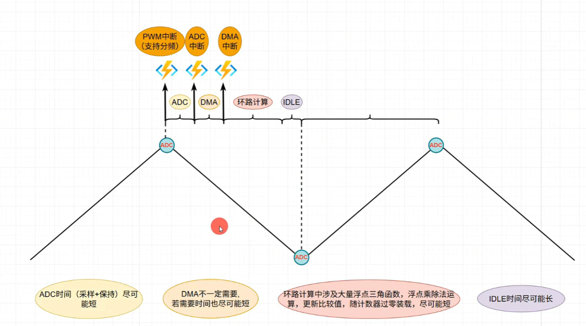

# 电源题简介
本文档主要对全国大学生电子设计大赛的电力电子方向作简单介绍  
作者：电气23.3 毛晨镔

- [电源题简介](#电源题简介)
  - [考察方向](#考察方向)
  - [题目特点](#题目特点)
  - [考察指标](#考察指标)
    - [特点](#特点)
    - [常见参数：](#常见参数)
  - [相关课程](#相关课程)
    - [相关基础课：](#相关基础课)
    - [相关专业课：](#相关专业课)
    - [补充知识：](#补充知识)
  - [注意事项](#注意事项)
    - [软件时序](#软件时序)
    - [硬件与拓扑](#硬件与拓扑)
    - [仪器](#仪器)
    - [准备](#准备)
  - [相关资源](#相关资源)
    - [B站up推荐](#b站up推荐)
    - [常用网站](#常用网站)
  - [如何入门电力电子方向](#如何入门电力电子方向)
    - [硬件](#硬件)
    - [软件](#软件)
      - [单片机](#单片机)
      - [控制算法](#控制算法)
  - [准备模块](#准备模块)
    - [功率拓扑](#功率拓扑)
    - [无源器件](#无源器件)
    - [单片机相关](#单片机相关)

## 考察方向
**电力电子**方向  
对应电力电子化能量变换系统设计与控制（电气24版B方向）、柔性输电技术（电气23版C方向）  
题目主要考察对大功率、大电流的变换与控制  
核心部分为控制环路设计与功率拓扑设计  
是电子设计大赛中比较难的方向之一  
本科生阶段几乎不涉及数字环路部分讲解，仅涉及部分简单拓扑的分析  

## 题目特点
**对模拟电子技术要求较低**，能完整采到信号、正确添加偏置、实现滞回比较  
**对电力电子技术要求较高**，需要熟练掌握相关拓扑设计、器件选型、调试、控制算法等  
**对硬件要求很高**，大电压、大电流、高速开关导致对PCB布线的寄生参数极其敏感  
**对软件要求很高**，涉及到控制环路设计与参数整定，环路设计不好会导致炸管等事故  
**环路高度数字化，相位时序敏感，慎用数字滤波器**  
**用低压（5V/12V）控制高压（60Vdc、30Vac），需要隔离器件保护**  

## 考察指标
### 特点
**稳态参数为主，弱化暂态参数**  
**强调拓扑控制，弱化界面设计**  
**与指标高度相关**  

### 常见参数：
瞬时值（DC）、有效值(AC):  
变流器输出电流、电压的电平要求  
给定要求值+容许范围  
容许范围内满分  

频率：  
交流输出时电流/电压输出频率  
给定要求值+容许范围  
容许范围内满分  

THD：  
输出电流电压的谐波畸变率  
表示谐波分量多少，即所谓的变流器输出质量  
低优指标  

负载调整率：  
在不同负载下电压电流输出变化率  
表示控制稳定性和环路设计好坏  
低优指标  

效率：  
输出功率/输入功率  
表示变流器自己消耗的功率大小  
主要为单片机、屏幕、辅助电源、MOS的开关损耗  
高优指标  

功率因数：  
电流电压相位差的余弦值  
常在PFC、整流、逆变并网中考察  
分为单位功率因数和指定功率因数  
题目给定要求值+容许范围  
容许范围内满分  

功率比、电流比：  
两台变流器输出的功率或者电流之比  
常在并网、并机中考察  
考察功率分配算法的设计  
题目给定要求值+容许范围  
容许范围内满分  

## 相关课程
### 相关基础课：
复变函数、拉氏变换、电路、模电、数电  

### 相关专业课：  
自动控制理论、电力电子技术  

### 补充知识：
变流器控制理论、PWM控制技术、常用功率拓扑及其控制环路设计  
这部分内容可以参考硕士毕业论文中的绪论部分  
控制环路部分以研究生课程为主，本科生相关课程涉及内容较少  

## 注意事项
### 软件时序
1、涉及到PWM发波，所有的计算都需要在一个PWM周期内算完，所以对各种延时比较敏感  
2、CPU处在高频中断状态，功能能下放到外设就不要用CPU完成（比如通信用外设而不是GPIO模拟）  
3、PWM/ADC的控制中断为最高优先级，注意做中断保护，慎用中断嵌套，其他中断尽可能短  
4、提前准备好所有软件算法，测试功能，代码模块化，用结构体/函数封装  

### 硬件与拓扑  
1、部分拓扑浮地输出，需要高压探头、电流探头、高共模输入运放，**能隔离就隔离**  
2、**功率拓扑建议驱动和MOS集成至一个PCB**  
3、**功率拓扑和滤波建议分成两个模块**  
4、**每个高频输出的桥臂都需要串联电感，桥臂电感相同**  
5、**电源、PWM信号、模拟采样反馈建议留检测点**  
6、**功率流输出需要留电流电压测试端口，方便测评时接功率分析仪/示波器/万用表**  
7、功率部分高速开关，杂波多，**单点接地，至少区分功率地和低压地**  
8、高速开关导致di/dt、dv/dt大，对PCB布线及其敏感，**大电流环路包围面积尽可能小**  
9、**PCB、芯片多备一点，防止比赛期间用完/炸光**  
10、**禁止用杜邦线，大电流禁用排线**  

### 仪器
1、如何在没有差分探头下看浮地输出：用没有地线的插排，示波器当单通道用，**示波器两通道地线均直接接到插头的地线**  
2、仪器上：尽量用原装探头，尽可能减小底线环路面积。非原装的鳄鱼夹在测量Vgs等波形时会引入部分振铃  
3、需要准备高压探头、电流探头  
4、变压器先过隔离后过调压，没有隔离谨慎并网  

### 准备
1、电赛4天3夜，基本不可能比赛期间嘉立创打板子，**提前调好模块，调通拓扑**  
2、尽可能多做真题，**以真题为练手工具，赛前至少做1道**  
3、分工：一软一硬一摇摆，软+硬负责方案设计/报告撰写  

## 相关资源
### B站up推荐  
[晋B114514](https://space.bilibili.com/52867486)  
变流器控制环路设计  
[傅�F帆](https://space.bilibili.com/519909115)  
电力电子技术课程（本+研）  
[西瓜粥西瓜粥](https://space.bilibili.com/287344644)  
电力电子技术课程  
[DR_CAN](https://space.bilibili.com/230105574)  
自动控制原理  
[电力电子电机硕博士](https://space.bilibili.com/402754182)  
变流器建模  
[木修于淋](https://space.bilibili.com/446167138)  
变流器建模  
[萤火虫电源](https://space.bilibili.com/289158913)  
变流器建模  
[电力电子实践](https://space.bilibili.com/193413217)  
C2000软件开发、部分双向DCDC  
[江协科技](https://space.bilibili.com/383400717)  
STM32F1单片机（HAL+标准库）  
[唐老师讲电赛](https://space.bilibili.com/28143041)  
各种知识点都有  

### 常用网站
[全国大学生电子设计竞赛培训网](https://www.nuedc-training.com.cn/)  
[ADI](https://www.analog.com/cn/index.html)  
[英飞凌](https://www.infineon.com)  
[TI](https://www.ti.com.cn/)  
[立创商城](https://www.szlcsc.com)  
[立创开源广场](https://oshwhub.com/explore)  
[CSDN](https://www.csdn.net)  
[陶晶驰](https://www.tjc1688.com/)  
[正点原子资料中心](http://www.openedv.com/docs/index.html)  
[TI数字电源库手册](https://software-dl.ti.com/C2000/c2000_apps_public_sw/c2000ware_sdk/digitalpowersdk/5_03_00_00/html_guide/index.html)  

## 如何入门电力电子方向
**刷真题**
### 硬件
立创开源广场复现开源工程，把开关波形调好，把所有拓扑、模块做一遍  
### 软件
#### 单片机
选一个适合的单片机（C2000\STM32），把PWM、ADC、PWM触发ADC、中断、UART、SPI等片内外设调好，选好合适的片外ADDA、屏幕，把相关驱动准备好  
#### 控制算法
搞清楚相关算法s域传递函数，搞清楚所有参数的实际含义，参数过大过小的现象，连续函数离散化，把所有算法在C里面实现一边，把往年赛题涉及到的控制环路算一遍，把基础拓扑的环路参数调好  
相关算法可以参考Ti在**C2000Ware数字电源库内的参考设计**，在根目录的sulutions文件夹内，网页版说明在本文件开头的常用网站内给出  

## 准备模块
### 功率拓扑
单相/三相H桥（整流逆变）  
UCC28180/UCC28019硬件PFC  
四开关buck-Boost（DC-DC同相升降压，FSBB）  
ACAC交流斩波  
桥式二极管无控整流  

### 无源器件
大电流LC滤波器（5A，400V/630V）、大容值（2000uF）电解电容  

### 单片机相关
电压电流采样、片外AD/DA  
屏幕（串口屏/TFT/OLED）  
单片机核心板（买），**多备几块，防止比赛期间没有备件/备件耗尽**  
单片机底板（做）（排座连接，底板集成按键、ADC输入滤波+跟随器、屏幕、BootLoader、XH2.54排座、电压插头、地线插头）  
